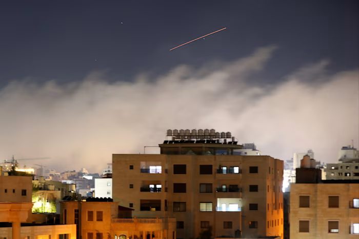
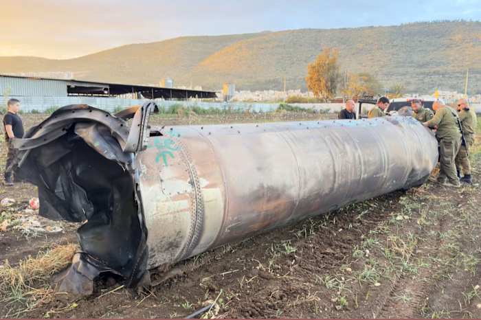
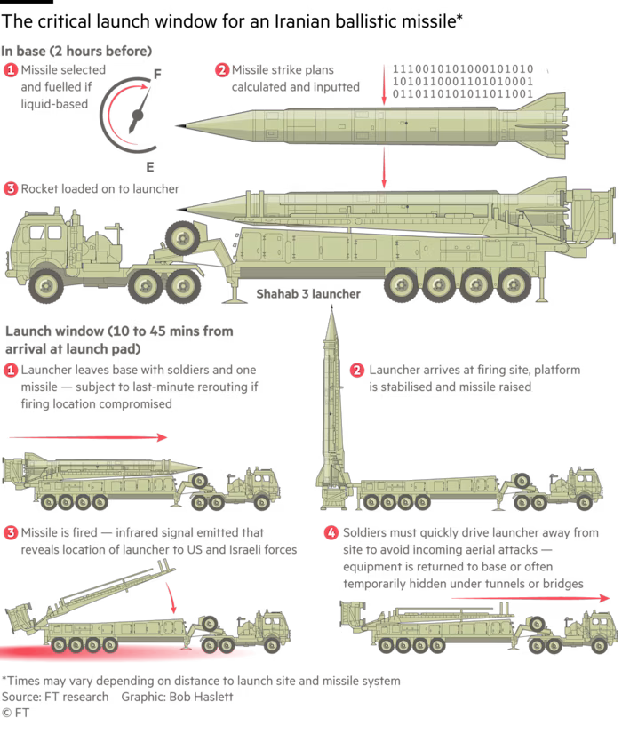

# Military briefing: How Iran keeps firing missiles under bombardment

**Source:** https://archive.is/2bM7u

---

Iran is waging its missile campaign against Israel and the Gulf states under conditions that would normally incapacitate a modern military.

It has endured sustained, unchallenged air attacks; disruption of communications networks; and targeted killings of senior commanders.

Yet despite what Israeli and US officials claim is the near-total suppression of Iran’s missile-firing capacity, Tehran has retained a limited but persistent ability to co-ordinate strikes. That highlights what experts said was a system designed for wartime attrition.

Iran’s shorter-range firepower was also in evidence on Friday when it shot down a US fighter jet over its territory for the first time in the five-week war, a major escalation in the conflict.

Iran has launched 400 to 500 ballistic missiles at Israel since the conflict began, at a pace significantly lower than in Israel’s 12-day war against the Islamic republic last year. But Iran has also fired more than 3,500 short-range missiles and drones at the US’s allies across the Gulf, according to the UK defence ministry, which released figures last week during a visit to the region by defence secretary John Healey.

“What struck me being here over the last couple of days is how clear it is in the Middle East that Iran is expanding its attacks,” he said after meeting Qatari prime minister Sheikh Mohammed bin Abdulrahman al-Thani on Tuesday.

The UAE defence ministry said on Saturday that it had engaged 56 Iranian drones and 23 ballistic missiles in the previous 24 hours, a combined total of 79 attacks — which exceeded all daily figures since March 8.

Israeli estimates suggest that about 70 per cent of Iran’s launchers and missile stockpile have been put out of action by Israeli and US attacks, although Reuters, citing US sources, reported on March 27 that Washington could only determine with certainty that it had destroyed around a third of Iran’s missile arsenal.

Whatever is left, however, is proving disproportionately difficult to eliminate.

The initial phase of Iran’s campaign relied on barrages on a pre-planned set of targets, according to Raz Zimmt, a former Israeli military intelligence analyst. “The early barrages at the start of the war were orders and target sets given ahead of time,” he said.

Since then, Iran’s command system has adapted. Orders still flow down the chain of command, but under far more constrained conditions.

He added that despite the loss of several key Iranian military leaders, centralised command and control remained. That has been demonstrated by Iranian forces’ ability to readjust after certain targets have been hit, or to hit specific targets in retaliation for what has been struck in Iran.

One example is the Iranian strike on Dimona, the town that hosts Israel’s secretive nuclear facilities, on 19 March after Israeli jets hit Iranian nuclear sites in Natanz. Another is Iran’s attack on the liquefied natural gas infrastructure in Ras Laffan in Qatar after an Israeli strike on Iran’s South Pars gasfield.

“The orders do come down,” said Zimmt. “The soldier in the desert doesn’t necessarily know Natanz was just hit and that now it’s time to focus more on southern Israel [Dimona]. A clear order has to arrive.”

He added: “It’s an orderly system under quite difficult conditions. They’re able to do it.”

Where command and control is exercised, however, appears to have shifted after the war began.

“It’s all decentralised, and led by local leadership in the various regions. Iran built up this system over decades — they knew this war was coming,” said a person familiar with the matter.

Iran refers to decentralised command as a “mosaic” defence strategy. “We’ve had two decades to study defeats of the US military to our immediate east and west. We’ve incorporated lessons accordingly,” said Iran’s foreign minister Abbas Araghchi in a post on X on March 1. “Decentralised Mosaic Defense enables us to decide when — and how — war will end.”

The mosaic doctrine “is designed to survive decapitation”, said Behnam Ben Taleblu, an Iran expert at the Foundation for Defense of Democracies, a US think-tank, adding that it allows for a level of autonomy for field commanders not usually seen in authoritarian militaries.

“I do believe command and control has been shredded, but the Khatam al-Anbiya [wartime General Staff] is still able to respond in kind. Because they have a big operational picture to see what has been hit, to then call a unit to say ‘respond in kind’.”

Analysts say Iran has adapted to threats over the years.

“Iran, quite long ago, appears to have taken some measures to ensure security forces can keep active in the event of a ‘decapitation’ strike on leadership,” said Robert Tollast of the Royal United Services Institute in London. “Local commanders have a good sense of what to do if there are no orders. In practical terms, this still requires command and control infrastructure of some kind.”

Given that radios and cell phones would be intercepted, he said, missile crews might be using field telephones or even messengers to communicate. There had also been reports of a military fibre-optic system, Tollast said.

For Israel and its allies, the campaign has entered a more drawn-out phase: tracking and eliminating the last, hardest-to-find elements of Iran’s arsenal. Nadav Shoshani, an Israeli military spokesperson, said the dynamic has shifted: “The smaller numbers are left, the more surgical it is. [The] threat goes down but they’re harder to find.”

Experts believe that missile fire is coming mainly from mobile launchers rather than from the static emplacements in a dozen massive underground bunkers, dubbed Iran’s “missile cities”, which have been heavily bombed by the US and Israel.

“Above-ground launchers, with their time-consuming fuelling and targeting preparations, are much more vulnerable. But they’re also mobile and much more plentiful and expendable,” said Jonathan Ruhe, fellow for American strategy at JINSA, a Washington-based think-tank.

Even if the US and Israeli claim that more than 70 per cent had been destroyed or put out of action were true, he said, “the mobile launchers are Iran’s better option to sustain a steady rate of missile fire”.

Iran’s remaining launchers — fewer in number but more elusive — can fire, relocate and blend into the landscape, complicating efforts to find them.

Israeli air defences, meanwhile, are intercepting about 90 per cent of incoming projectiles, while daily launches by Iran have stabilised at around seven to 15 missiles since the third day of the war.

For Israel, this is a more manageable threat than anticipated. “Missile numbers [are] much lower than seen in the past and much lower than expected. We prepared for a larger threat,” said Shoshani.

Former US military officers also said they were prepared for worse. “I used to worry as Centcom commander about volleys of 250 missiles against Al Udeid air base [in Qatar] or Al Dhafra [in the UAE], and that has not materialised,” Frank McKenzie, former head of US Central Command covering the Middle East, said in a recent webinar.

Iran, however, has managed to bomb specific targets with pinpoint accuracy, focusing early in the conflict on radar installations. On Friday, an Iranian drone severely damaged a US E-3 airborne surveillance plane on the ground in Saudi Arabia, costing about $700mn.

Few believe Iran will completely run out of missiles, and the country’s forces are likely to be able to sustain their campaign with a small number of missiles a day.

“The regime needs simply to hold on to win this war, so it is willing to fire smaller salvos over longer periods of time, and smaller salvos against pre-determined targets are easier to co-ordinate and conduct,” said Ruhe.

*Cartography by Steven Bernard, illustration by Bob Haslett and data visualisation by Alan Smith*