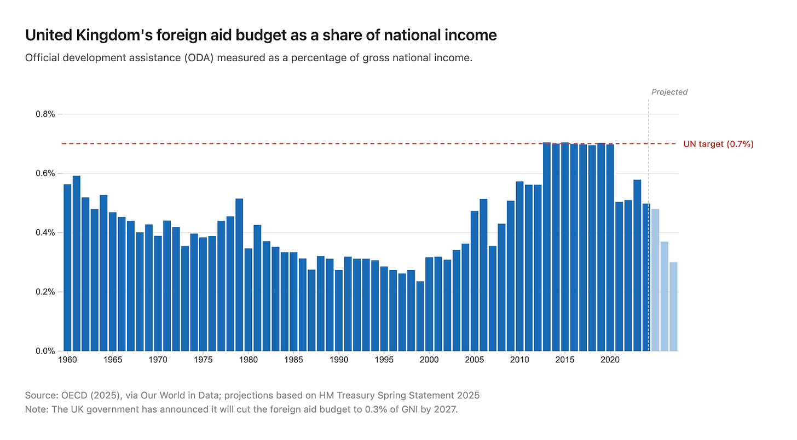
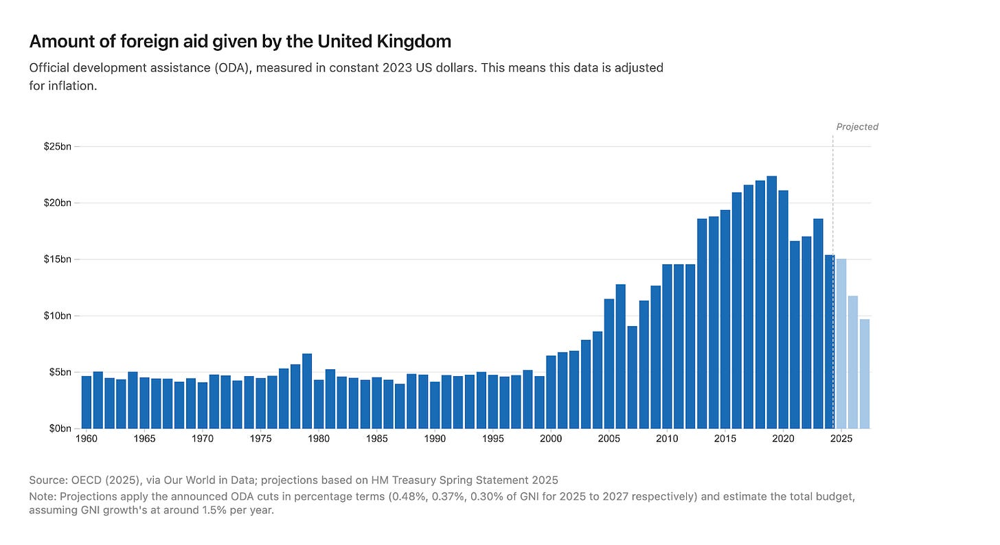
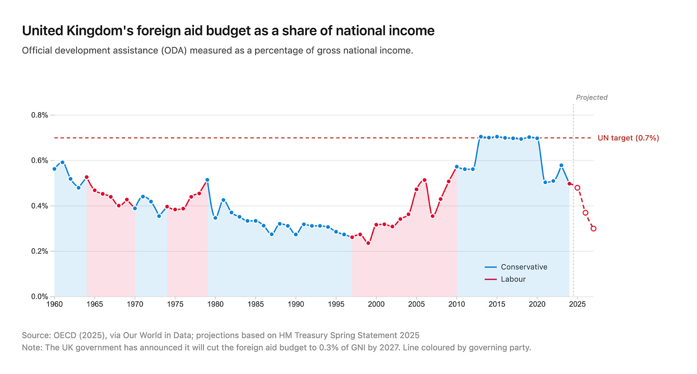
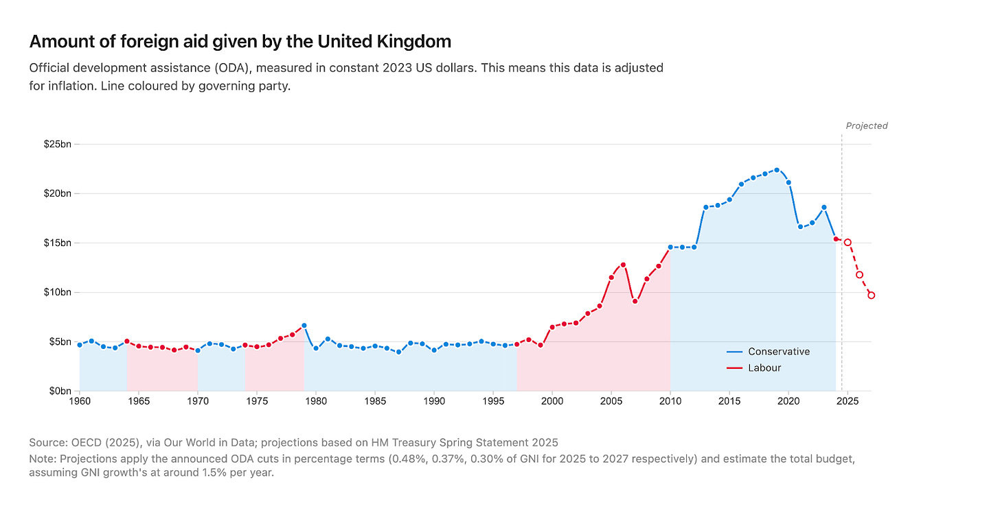
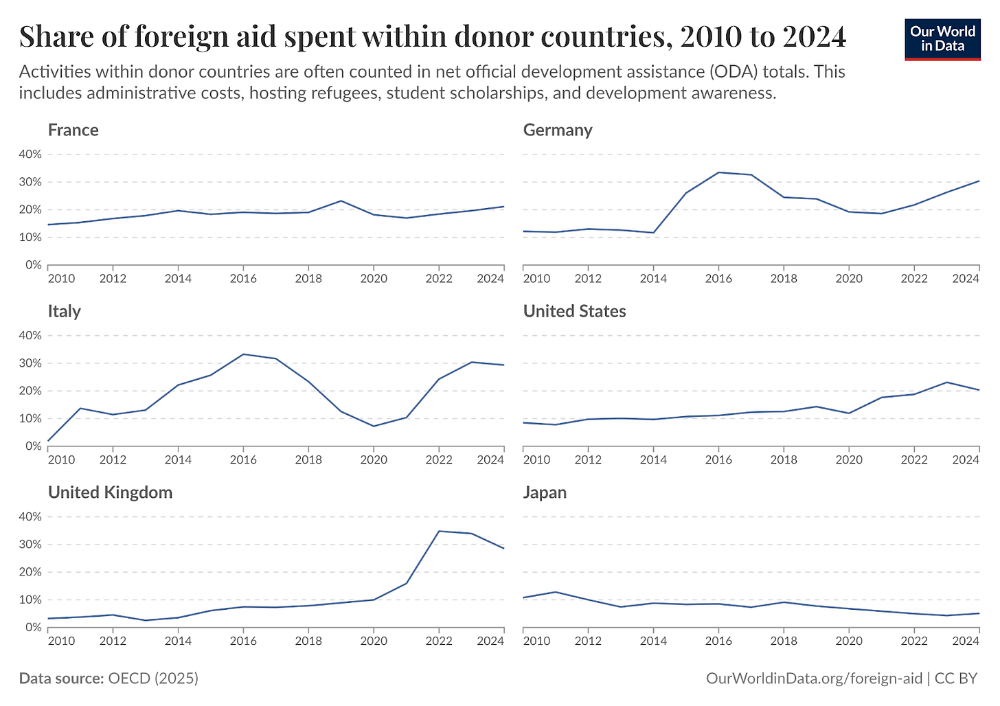
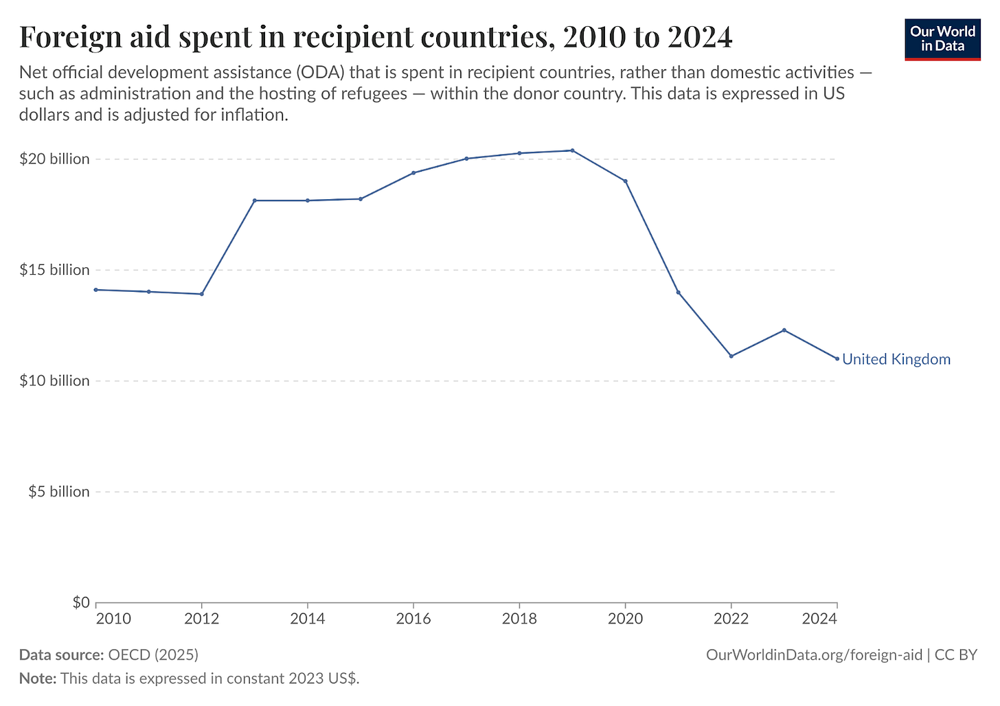
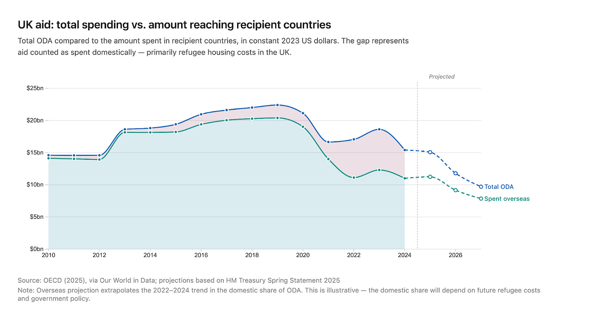
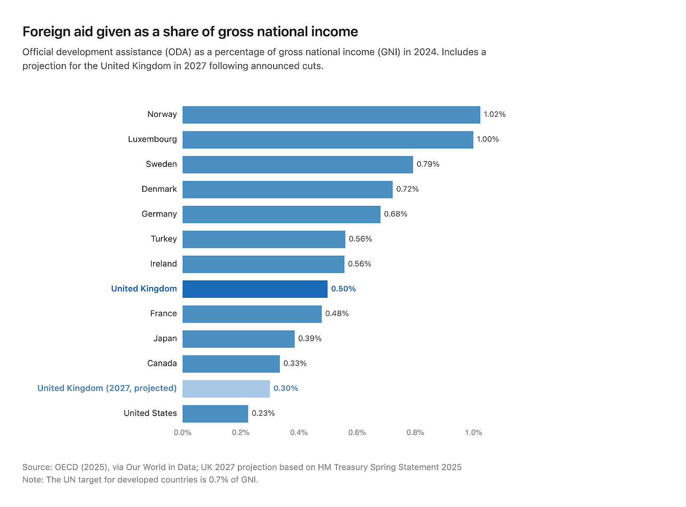

# The UK is cutting its aid budget to the lowest level in decades

### After pledging to increase the budget to 0.7% of GNI, the government is cutting it to 0.3%.

Cuts to USAID have received a decent amount of public attention over the last year.

Understandably so: the United States is the world’s largest aid donor in pure dollar terms (even though it’s far down the list when compared to the size of the economy). As I wrote previously, this aid was probably saving the lives of several million people each year through its health programs alone, so taking it away likely costs many lives, too.1

But some other countries have followed suit and started to cut their aid budgets as well. These have received very little attention by comparison.

One of those — and the one that has announced the steepest cut — is my own country, the United Kingdom. The coverage of it has been so sparse that you’d be forgiven for completely missing it.

I wanted to take a look at how these cuts fit within the UK’s historical contributions. It’s only when you visualise this data that the depth of these cuts becomes clear.

In 2024, the UK’s foreign aid budget was equivalent to 0.5% of its Gross National Income (GNI). This was down a bit from the 0.7% of GNI given throughout most of the 2010s, which was actually the UN target for wealthy countries to contribute.

Last year, the Labour government announced it would cut this to 0.3% by 2027, with reductions in stages over the next few years. In the chart below, you can see this in the context of the aid budget over the past 60 years.

The UK has not seen a contribution as low as 0.3% this century; the last year it was below this level was in 1999. In my lifetime, this has happened only five times (all in the late 1990s).

You can also see how low these levels are compared to the UN target.

We might argue that, since the UK economy has grown over that time, we’re still giving more in absolute terms to foreign aid.

Below, I’ve made a chart of the budget in US dollars (this is adjusted for inflation).2

In 2027, the budget may dip below $10 billion. It’s true that in dollar terms, the budget will be higher than it was in the 1960s through the 1990s. But it will be at its lowest level in decades (last matched in 2007).

What’s perhaps most damning about these cuts is the political party carrying them out.

Below is the same chart of foreign aid as a share of GNI, coloured by the party in government. Foreign aid contributions did increase a lot in the first decade of the 2000s under Labour (the left-leaning party). But the only years where the UK met the 0.7% of GNI target were under a Conservative government (which is probably not what people would expect).

The current and announced cuts are happening under Labour. In its 2024 manifesto, the party did pledge to increase aid from 0.5% to 0.7%. Granted, it was caveated in a way that made it easy to break:

*“Labour is committed to restoring development spending at the level of 0.7 per cent of gross national income as soon as fiscal circumstances allow.”*

I guess the argument is that fiscal circumstances don’t allow — and won’t — while they’re in office.

Just for completeness, here’s the coloured line chart, but showing aid given in absolute terms.

**Less and less foreign aid is being spent overseas**

The amount of money being spent on overseas development is not just falling due to budget cuts, but because aid budgets are being spent differently, too.

In recent years, around a third of the UK’s budget has been spent at home. You can see how this has increased over time in the chart. In 2010, it was just 3%.

A number of other countries have seen similar trends, so the UK is not an outlier. You can read more about this on Our World in Data.

Domestic spending includes administrative costs, scholarships, and development awareness programs, but the large increase has been in hosting refugees within the UK. The invasion of Ukraine had a big impact on this, which is why you see the bump in 2022 in particular.

Now, there’s nothing wrong with spending money this way: one way to help international development is to send money overseas, and another is to house and look after people fleeing desperate situations.

But the reality is that less and less money has been sent internationally in the last few years.

In the late 2010s, the overseas budget was around $20 billion. It’s now about half that.

As these aid cuts go even deeper, we would expect overseas development funding to fall even more. Below are rough projections that assume the share of aid spent domestically declines gradually to around 19% in 2027, which we might expect, as the cost of hosting refugees falls.3

Based on this, while the total aid budget in 2027 might be 0.3% of GNI, the amount spent internationally will be just 0.24% of GNI.

**The UK is falling down the generosity rankings**

How would these cuts affect the UK’s contributions relative to other high-income countries?

In the chart, I’ve shown the shares of GNI given as foreign aid across a selection of countries [these are not all top donors] in 2024. I’ve added where the UK would sit in terms of its 2027 contribution.

It was previously far behind the *top* top donors, but on a par with some of its Western European neighbours. In the next few years, it’s set to slip to become one of the least generous. Remember that when adjusted for money sent *overseas*, its contribution could be as low as 0.24%.

The UK is not the only country on this list pledging to cut back. France, Sweden and Switzerland are also set to reduce their budgets. And who knows what the US has planned. But the UK stands out as the non-US donor that has announced the deepest cuts.

Some countries are moving in the opposite direction: Japan and South Korea, for example, have increased their budgets significantly over the last decade despite starting from a low base.

**On a more personal note**

As a Brit passionate about international development, these cuts are disappointing, and if I’m honest, embarrassing. Sure, not every pound spent on aid is amazingly effective, but many programs are genuinely life-saving for millions, and life-bettering for many more. This is particularly true for health interventions. A relatively small amount of money — just tenths of a per cent of the national economy of rich countries — can go extremely far in some of the poorest countries in the world.

It’s easy to feel a bit helpless at times like this. But beyond advocating for the restoration of aid budgets, there are other things we can do as individuals to cover a small amount of the loss.

I give quite a bit of money to cost-effective charities. I’ve taken the Giving What We Can pledge and donate 10% of my income each month to recommended programs (mostly in global health).

GiveWell is usually my go-to source for figuring out where these donations can do the most good. I usually donate honorariums from book festivals and other events to charities like the Against Malaria Foundation. My partner knows that a donation is the perfect birthday gift.

Small donations from individuals can’t and won’t cover the tens of billions being cut from international development spending, but it’s something. And saving one or two lives is surely better than doing nothing.

Charles Kenny and Justin Sandefur, from the Center for Global Development, have done excellent work on developing estimates for the number of lives saved by USAID.

Getting estimates for 2026 and 2027 relies on some assumptions about economic growth, so there's some uncertainty there. But these numbers are likely close to the final figures.

Just to emphasise: these are rough extrapolations, so don't put too much weight on the precise numbers.