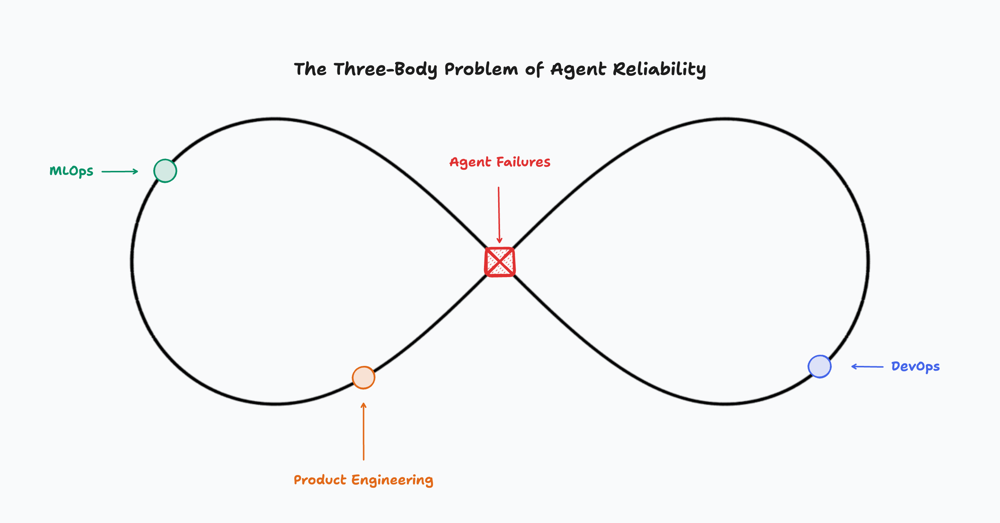

# Production-Aware RL: How Agents Learn From Failures

**June 23, 2025**

Today's approach to AI agent reliability follows a fundamentally broken pattern. We deploy agents, wait for them to fail in production, then scramble to debug and patch them manually. This worked when we had dozens of agents. It's about to catastrophically fail when we have thousands.

In 2025, 85% of enterprises are planning to adopt AI agents to their business operations¹. This massive increase in agent deployment, documented in recent industry reports¹², will create an unprecedented surge in operational complexity: agent traces, tool calls, and failure events across every layer of the enterprise stack.

## The Three Body Problem

When a production agent fails today:

**MLOps**notices anomalies in model outputs**Product Engineering**tries to understand business impact**DevOps**patches and redeploys

This is organizational physics’ version of the three-body problem. Just as three celestial bodies create chaotic, unpredictable interactions, these three teams orbit around agent failures with no stable solution. Each corrective move perturbs the others—MLOps updates a model, breaking Product’s features, forcing DevOps to roll back, which in turn invalidates MLOps’ metrics.

*This organizational three-body problem creates chaotic, unpredictable interactions where each team's corrective actions perturb the others.*

**No single team owns the remediation loop.**

From a 2025 survey of 500 engineering leaders and practitioners, **67% say AI-generated code has actually increased the debugging load**.

In short, coordination costs are rising almost as fast as model capabilities.

## Failures as Training Data

Finding high-quality data is demanding—Meta, for example, recently announced a *large-scale data partnership* with Scale AI to source the labeled corpora their models require. Fine-tuning typically hinges on tens of thousands of well-curated examples. Even "sample-efficient" projects struggle, the Qwen3 team needed extensive filtering and validation to distill just **3,995** usable query-verifier pairs from a much larger dataset for their Reasoning RL stage (Qwen Team, 2025).

Few organizations actually possess such datasets.

What they *do* have are inputs, traces, context documents, and their own engineering judgement. Teams often avoid fine-tuning because they assume they lack data—but they have failures, and plenty of them.

We asked: what if we could fine tune on this “production-aware" dataset?

Every production failure contains:

- The exact input that broke the agent
- What should have happened
- What actually happened
- Rich contextual information

This is precisely the data you actually have, not the 10,000+ labeled examples you're supposed to have. Yet we throw it away, logging it for humans to manually review later.

Customers typically self-select out or are guided out of fine-tuning because they believe they don't have enough data. But they do have failures. Lots of them!

## Production-Aware RL

Our work explores whether those same failure events, rather than being treated as costly, can become the raw material for automated improvement. We're building on the research that has demonstrated that extended RL training helps models "discover truly new solution pathways not present in base models"⁷ and recent advances showing how ProRL enables new reasoning capabilities through extended training¹⁰, to develop a framework for continuous production learning.

The idea is straightforward: reinforcement fine-tuning without labels via test time compute using both online and offline RL.

How?

-
**Policy view.**A deployed agent is nothing more than a policy π mapping inputs to outputs. When the policy produces an undesirable outcome, we treat that interaction as a low-reward trajectory rather than a bug. -
**Reward synthesis.**We construct a domain-balanced reward model where the λ-weights are learned from historical remediation data. This turns messy production logs into dense, task-specific feedback.`R(output) = λ₁ · correctness(output) + λ₂ · semantic_similarity(output, expected) + λ₃ · business_constraints(output)`

This addresses the core challenge that "models are typically rewarded solely for correct outcomes, not penalized for incorrect reasoning"⁹. However, we must be careful to avoid reward hacking, where agents exploit loopholes in the reward function¹¹.

-
**Local adaptation.**Instead of fine-tuning an entire model, we apply parameter-efficient updates (LoRA adapters) to the sub-network most closely associated with the failure. Early experiments show we can keep the adjustment below**0.1%**of the total parameter set while eliminating the observed error class. -
**Safeguards.**Before redeployment we generate adversarial test cases centered on the original failure and require a*99.9%*pass rate. The same harness serves as an automatic rollback trigger if post-release metrics drift. At the moment this loop runs overnight: failures are harvested during the day, updates trained after hours, and patched agents released the next morning. Preliminary online trials suggest the cycle time can shrink to minutes once the verification step is fully automated.

## From Offline to Online

Currently, this runs offline, collecting failures by day, training at night, deploying improved agents in the morning. We're moving toward fully online learning where agents update in real-time.

Early experiments show online learning works with:

- Parameter updates <0.1% per iteration
- 99.9% confidence on test suites before auto-deployment
- Instant rollback capabilities

## The Economics

Continuous adaptation is not free. Inference-time cost rises because each call now carries extra work: assigning a reward, running a small gradient step, and executing a targeted test sweep. In our prototype systems the overhead breaks down to roughly **40%** for reward evaluation, **35%** for the policy update, and **25%** for verification. Two trends change the cost equation:

**Rapidly falling inference prices.**Large-language-model inference has become dramatically cheaper—on the order of**1,000×**between 2022 and 2025³ ⁴ ⁵ ⁶ so the absolute dollar impact of the extra computation keeps shrinking. This "LLMflation" effect⁴ fundamentally changes the cost-benefit analysis.**Rising human-time cost.**As agent fleets grow, unplanned debugging work is consuming an ever larger share of engineering capacity. Teams we spoke with estimate the hidden labour cost of a recurring failure at tens of thousands of dollars per month.

Put simply, the marginal dollars spent on adaptive inference are beginning to under-cut the marginal dollars spent on human triage even before we account for the harder-to-measure benefits of faster recovery and tighter error bounds. Our ongoing studies aim to quantify that crossover point more precisely under different workload patterns.

## Open Questions

Several challenges remain:

**1. Cold Start**: Recent work on few-shot agent adaptation suggests meta-learning approaches, but bootstrapping new agents remains challenging.

**2. Distribution Shift**: Major task changes can invalidate learned improvements. Current drift detection methods fail at agent-scale.

**3. Multi-Agent Coordination**: The complexity of agent interactions makes failure attribution¹³ quite challenging. When agents interact, failures cascade.

**4. Verification Completeness**: Generating comprehensive test suites remains computationally intensive. What's the right trade-off between safety and speed?

**The next phase of agentic AI hinges on turning every failure into feedback.**

We believe Production-Aware RL is poised to repeat the GPT-3 moment for NLP: once the tooling reaches tipping-point maturity, adoption will accelerate and redefine how engineers ship and operate AI systems.

### References

- LitsLink. (2025). "AI Agent Statistics: Usage And Market Insights (2025)."
- Harness Blog. (2025). “The Role of AI in the SDLC”
- Adyog Blog. (2025). "The Economics of AI Training and Inference: How DeepSeek Broke the Cost Curve."
- Andreessen Horowitz. (2024). "Welcome to LLMflation - LLM inference cost is going down fast."
- NVIDIA Blog. (2025). "How the Economics of Inference Can Maximize AI Value."
- DataRoot Labs. (2025). "The State of Reinforcement Learning in 2025."
- SemiAnalysis. (2025). "Scaling Reinforcement Learning: Environments, Reward Hacking, Agents, Scaling Data."
- Qwen Team. (2025). "Qwen-3 Technical Report."
- OpenAI. (2025). "Reinforcement Fine-Tuning Documentation."
- NVIDIA. (2025). "ProRL: Extended Reinforcement Learning Training Unlocks New Reasoning Capabilities."
- Wang et al. (2025). "Reward Hacking in Language Models."
- Marktechpost. (2025). "2025 Agentic AI and AI Agents Report."
- Zhang et al. (2025). "Which Agent Causes Task Failures and When? On Automated Failure Attribution of LLM Multi-Agent Systems."